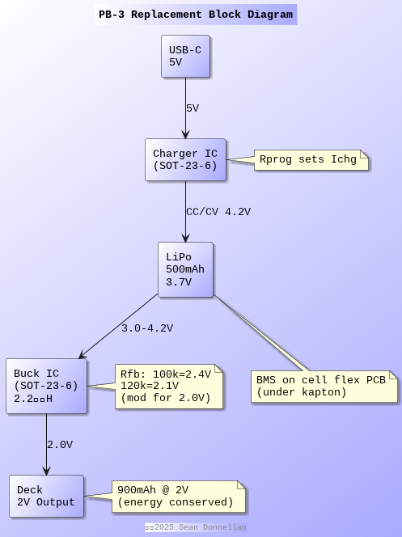

= PlantUML Diagrams
ifndef::flag-book[]
:toc: right
:toclevels: 5
:sectnums:
:sectnumlevels: 5
endif::[]
ifdef::flag-book[]
:imagesdir-save: {imagesdir}
:imagesdir: images
endif::[]

== PB3Architecture

.`PB3Architecture`

link:PB3Architecture.svg[SVG] 
link:PB3Architecture.png[PNG]

ifdef::flag-book[]
:imagesdir: {imagesdir-save}
endif::[]
