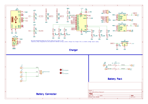
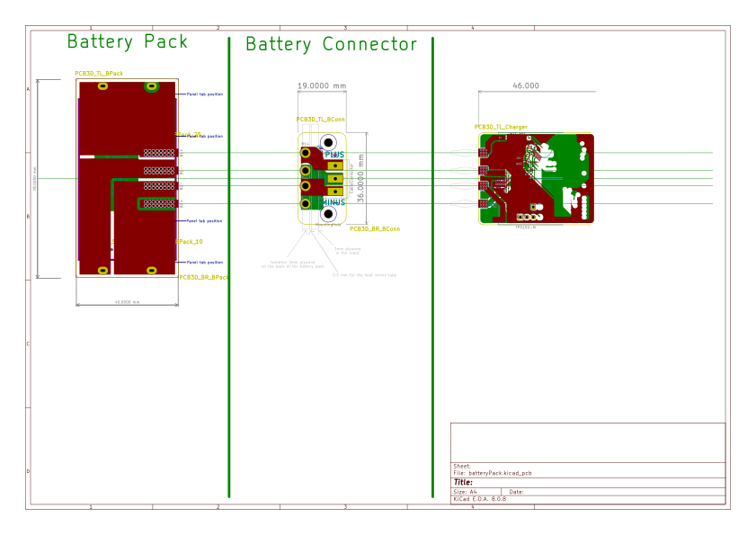

= Battery Pack - KiCad Hello World
Sean Donnellan
:description: Complete battery circuit example for CI/CD pipeline testing
:data-uri:

This uses the batteryPack example from https://github.com/INTI-CMNB/KiBot[KiBot's test suite].
It's a complete, tested project that demonstrates KiBot automation with a real battery charging circuit.

== Attribution

Based on `batteryPack` example from https://github.com/INTI-CMNB/KiBot/tree/main/tests/board_samples/kicad_8[KiBot test samples].

Copyright (c) 2020-2024 Salvador E. Tropea +
Copyright (c) 2020-2024 Instituto Nacional de Tecnología Industrial +
License: AGPL-3.0

== Circuit

Battery management system with:

* Battery connector
* Charging circuit
* Power management components
* Protection circuitry

== Getting Started (Noobs/me)

=== Install KiCad on Steam Deck

[source,bash]
----
flatpak install flathub org.kicad.KiCad
----

Launch: Application Menu → Science&Math → KiCad

=== Opening This Project

1. Launch KiCad
2. File → Open Project
3. Navigate to: `~/Documents/Github/donnels/aiwa-pb-3/kicad-hello-world/`
4. Select: `batteryPack.kicad_pro`

=== What to Look Out For

.Steam Deck quirks (what I'm testing this on):
* Small screen
** Use `Ctrl +` / `Ctrl -` to zoom schematic/PCB
** OR use external monitor
* Save often
** KiCad doesn't auto-save. `Ctrl+S` is your friend.
* File paths
** Flatpak sandboxes to `~/Documents`. Keep projects there.
* Performance
** PCB editor sluggish? Close other apps. Deck has 16GB RAM but KiCad uses chunks.

=== Learning Resources

.Video tutorials (watch before editing):
* link:https://www.youtube.com/watch?v=vaCVh2SAZY4[Getting Started with KiCad 8 - DigiKey] (30min) - Start here
* link:https://www.youtube.com/watch?v=5fvdxd0QhTw[KiCad 6 STM32 Beginner Tutorial] - Component placement, routing basics
* link:https://www.contextualelectronics.com/courses/shine-on-you-crazy-kicad/[Shine On You Crazy KiCad] - Chris Gammell's free course (in-depth)

.Official docs:
* link:https://docs.kicad.org/8.0/en/getting_started_in_kicad/getting_started_in_kicad.html[KiCad Getting Started Guide]

.Quick tips:
* Schematic
** Press `A` to add component, `W` to wire, `M` to move
* PCB
** Press `X` to route track, `V` to add via, `D` to drag
* Hotkeys
** Tools → Edit Hotkeys - memorize these or you'll hate life

== PCB

Multi-layer board with battery charging components.

See the KiCad files for full details.

== Outputs

.Expected to be generated by KiBot:
* `batteryPack-schematic.pdf` - Schematic
* `batteryPack-schematic.svg` - Schematic (SVG)
* `batteryPack-pcb-top.svg` - PCB top view
* `batteryPack-pcb-bottom.svg` - PCB bottom view
* `gerbers/` - Manufacturing files

=== Schematic

.Schematic (IF generated by KiBot)

=== PCB Top View

.PCB Top View (IF generated by KiBot)

=== PCB Bottom View

.PCB Bottom View (IF generated by KiBot)

== Shit Happens: Troubleshooting CI/CD Setup

=== GitHub raw URLs returning 404

**Problem**: Tried downloading KiBot test samples via `curl` from `raw.githubusercontent.com` - all returned 14-byte "404: Not Found" HTML pages instead of actual KiCad files.

decided to dodge the bullet and just git clone the repo.

[source,bash]
----
cd /tmp
git clone --depth 1 --filter=blob:none --sparse https://github.com/INTI-CMNB/KiBot.git
cd KiBot
git sparse-checkout set tests/board_samples/kicad_8
cp tests/board_samples/kicad_8/batteryPack.kicad_* /path/to/project/
----

This worked. Got real files.

=== GitHub Pages deployment 404

**Problem**: `actions/deploy-pages@v4` failed with 404:

----
Error: Creating Pages deployment failed
Error: HttpError: Not Found
----

**Root cause**: GitHub Pages not enabled for repo.

**Solution**: 
1. Go to https://github.com/donnels/aiwa-pb-3/settings/pages
2. **Source**: GitHub Actions (NOT "Deploy from a branch")
3. Save

The workflow uses `actions/upload-pages-artifact@v3` + `actions/deploy-pages@v4` which deploy artifacts, not branches.

=== KiBot not generating gerbers/drill/position files

**Problem**: `kibot.yaml` defines gerber, excellon, and position outputs but KiBot only generated first 5 outputs (schematic PDF/SVG, PCB top/bottom SVG). No gerbers, drill files, or position files in output.

**Investigation**:
[source,bash]
----
find . -name "*.gbr" -o -name "*.drl" -o -name "*.pos"
# Returns nothing
----

**Root cause**: KiBot command didn't explicitly request all outputs. May have stopped after warnings or first batch.

**Solution**: Add `-s all` flag to `build.yml`:

[source,yaml]
----
docker run --rm -v "$PWD":/w -w "/w/$dir" "$IMG_KICAD" \
  kibot -c kibot.yaml -s all
----

This explicitly requests all defined outputs instead of default subset.

== References

=== Minimal Examples
* link:https://github.com/INTI-CMNB/KiBot/tree/main/docs/samples/Consolidate_PCBs[KiBot batteryPack Example] - Complete battery circuit with charger, tested with KiBot automation
* link:https://github.com/INTI-CMNB/KiBot/tree/main/tests/board_samples[KiBot Test Samples] - Collection of minimal boards for KiBot testing

=== Tutorials
* link:https://www.youtube.com/watch?v=BVhWh3AsXQs[DigiKey: Getting Started with KiCad 8] (30 min)
* link:https://www.youtube.com/playlist?list=PLy2022BX6Eso532xqrUxDT1u2p4VVsg-q[KiCad 6 STM32 Beginner Tutorial Series]
* link:https://contextualelectronics.com/courses/shine-on-you-crazy-kicad/[Contextual Electronics: Shine On You Crazy KiCad] (paid course)
* link:https://docs.kicad.org/[Official KiCad Documentation]
