= Measuring the PB-3 and context
ifndef::flag-book[]
:toc: right
:toclevels: 5
:sectnums:
:sectnumlevels: 5
endif::[]
ifdef::flag-book[]
:imagesdir-save: {imagesdir}
:imagesdir: measurements
endif::[]

This directory holds every measurement photo, caliper log, and derived dimension used to build the PB-3 models.

== Measurement Photos

=== Original PB-3 SLA pack
==== Width [67.73, 67.75]
.Width calipered underside (67.73mm)
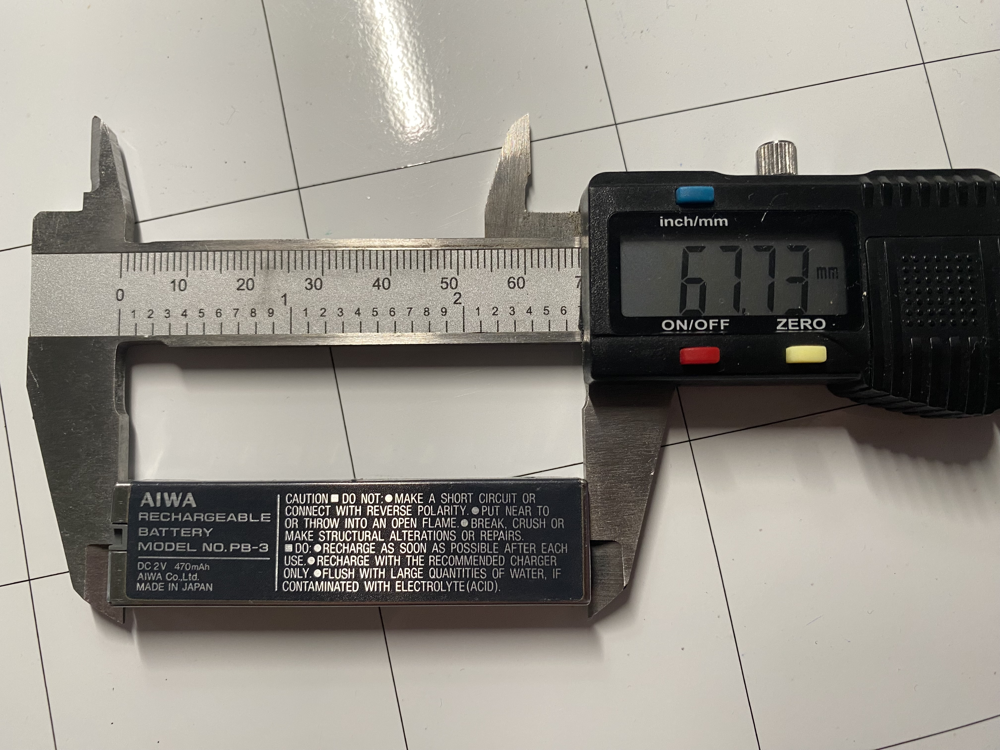

.Width calipered top (67.75mm)
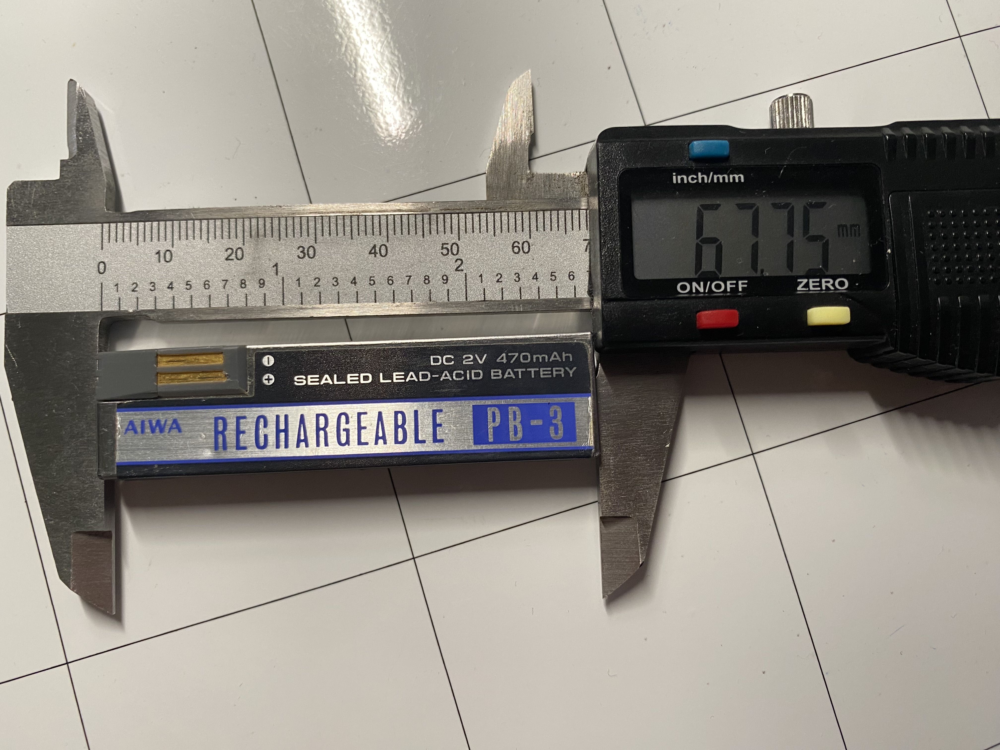

==== Height [8.19, 8.12]
.Height calipered side (8.19mm)
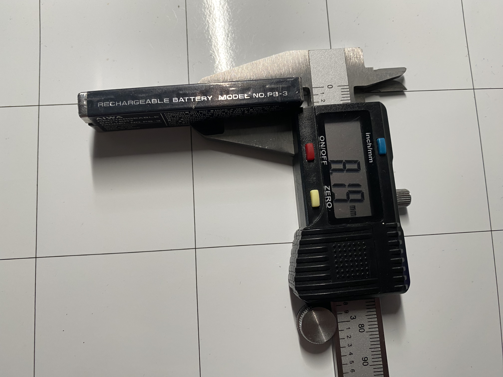

.Height calipered side (8.12mm)
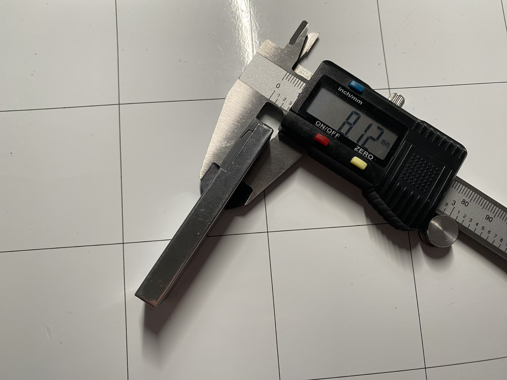

==== Depth [17.65, 17.55]
.Depth calipered top (17.65mm)
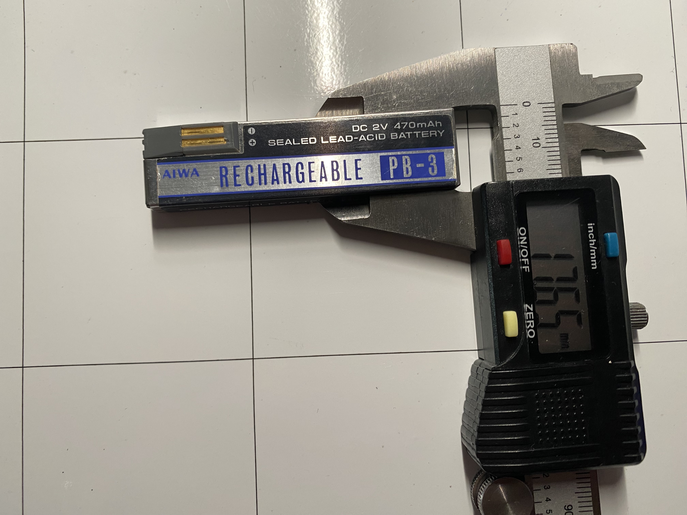

.Depth calipered top (17.55mm)
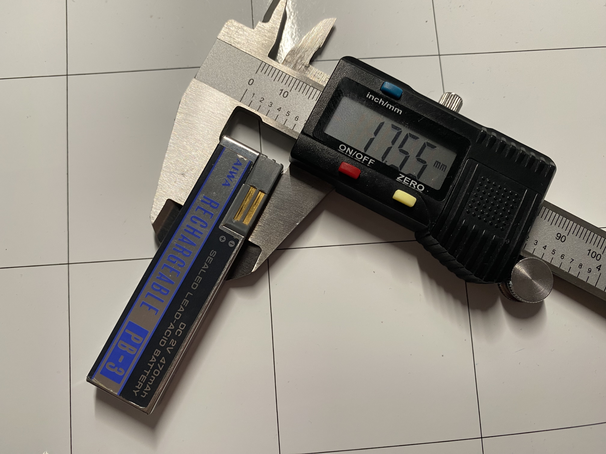

=== Battery holder

.battery holder Depth
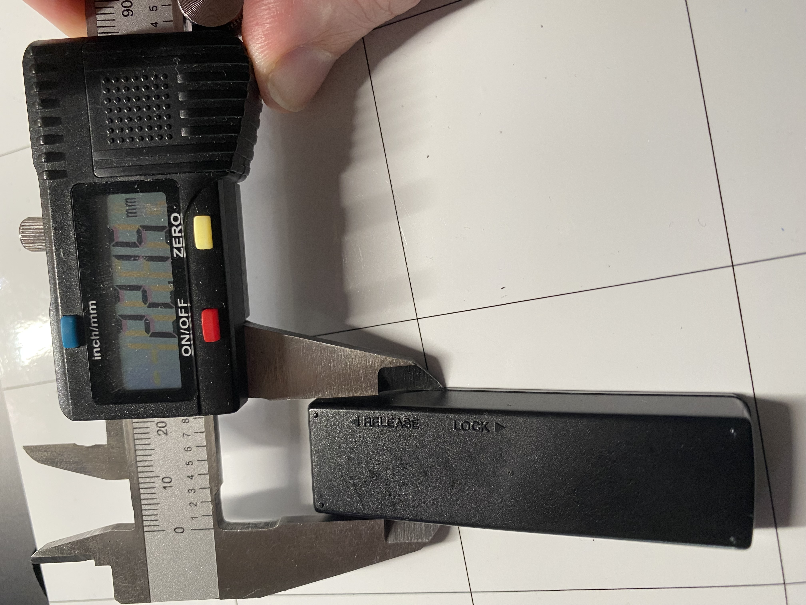

.battery holder Width
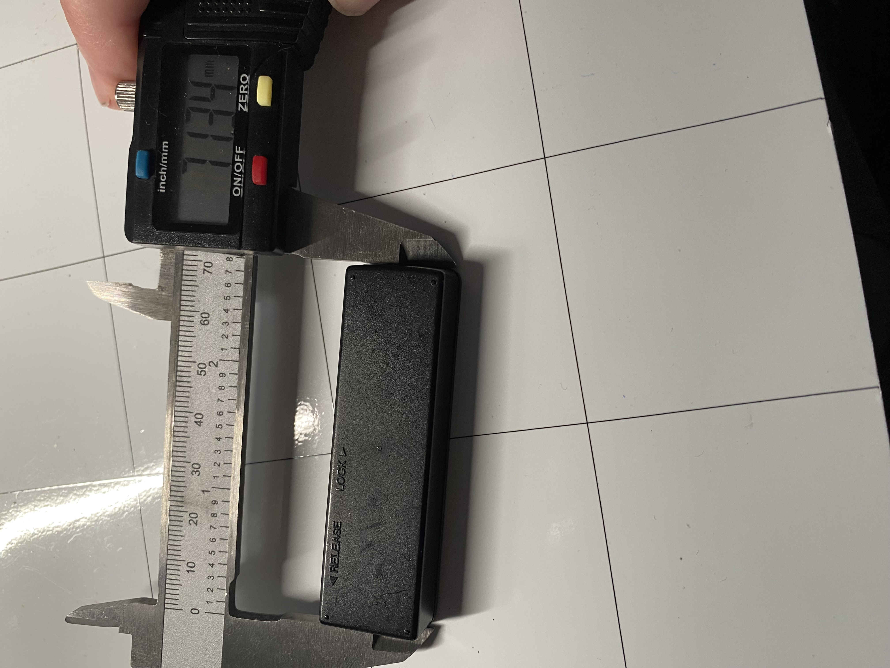

.battery holder Height
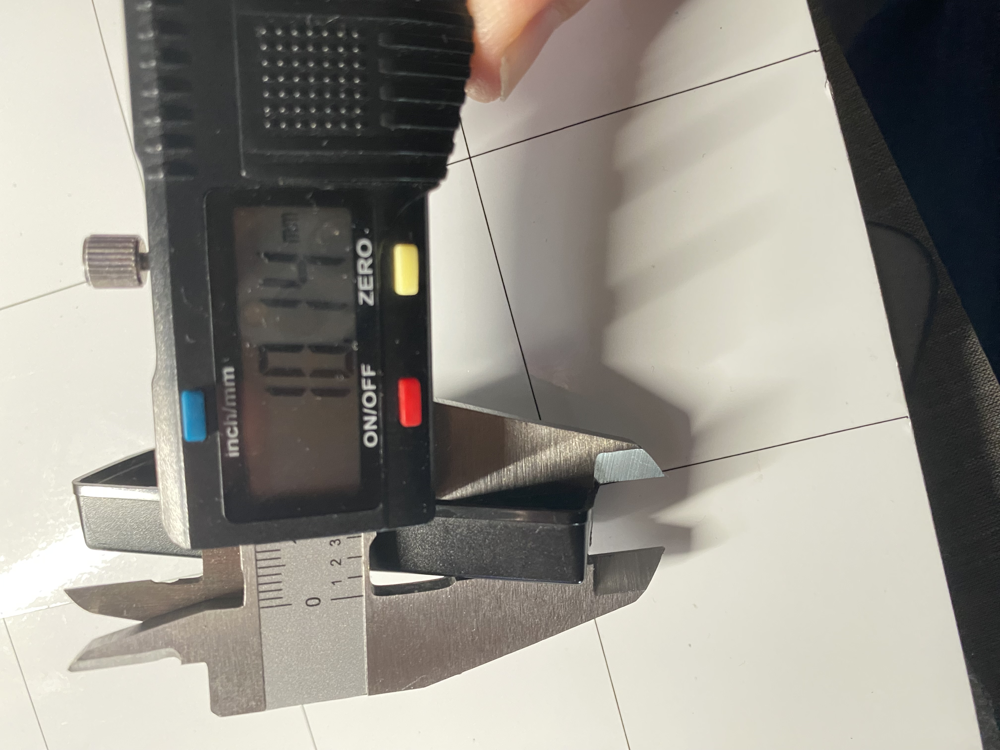

.battery holder inside view
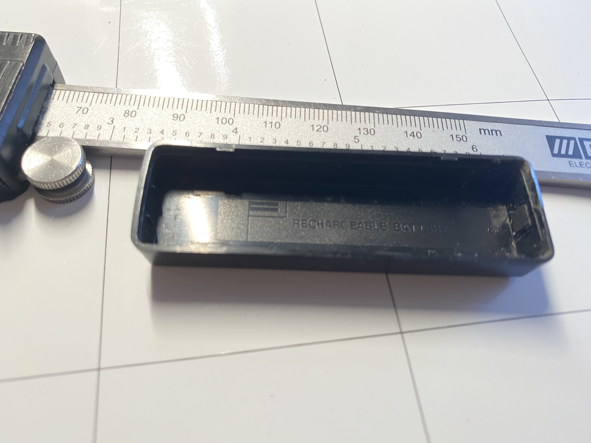

.battery holder inside view
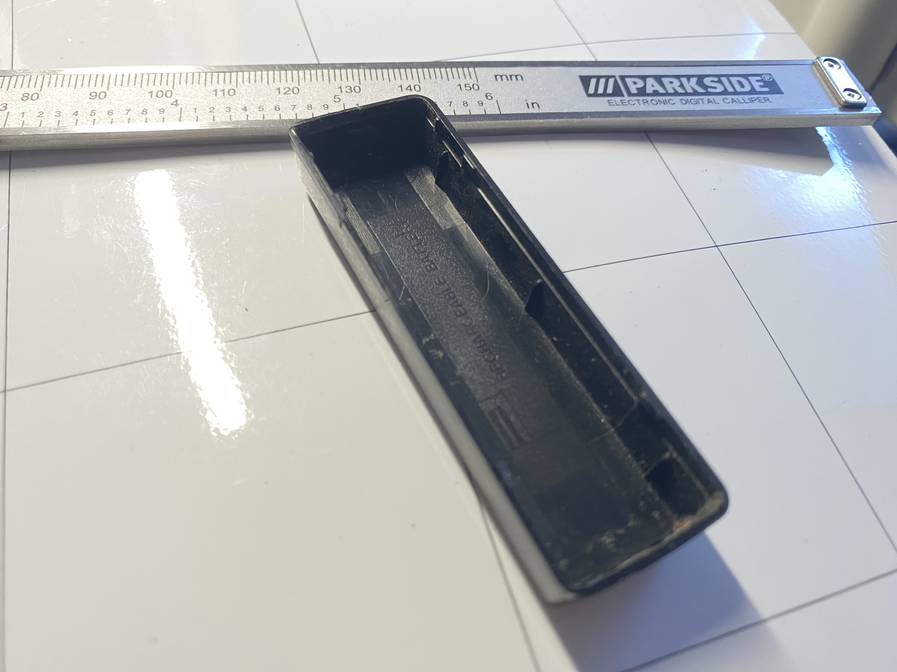

.battery holder inside view
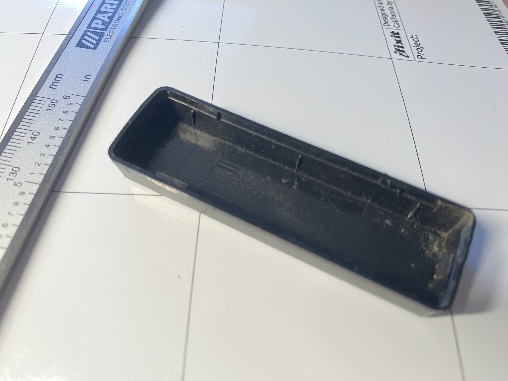

.battery holder inside view
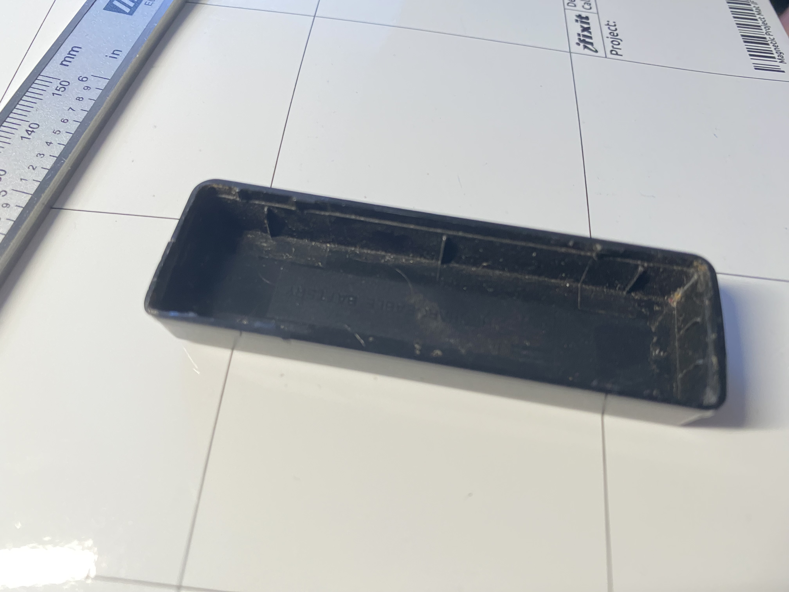

//END OF DOC
ifdef::flag-book[]
:imagesdir: {imagesdir-save}
endif::[]
