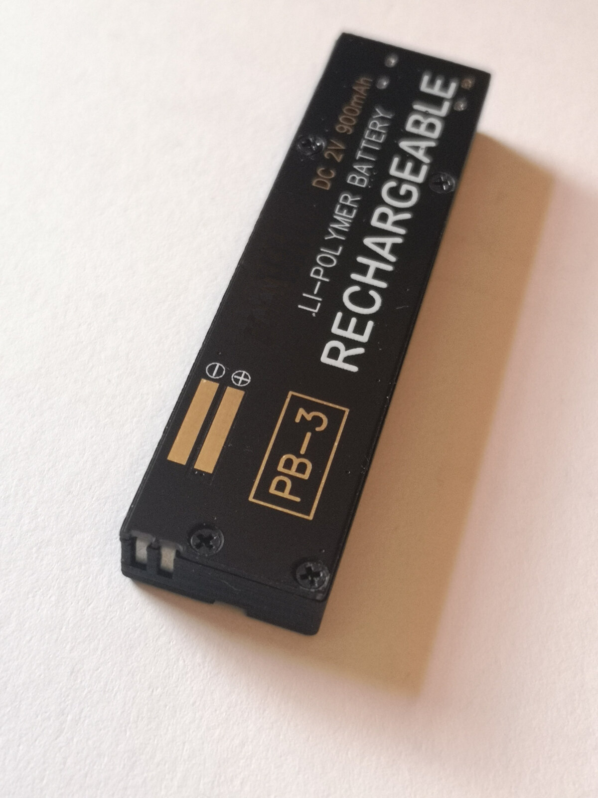
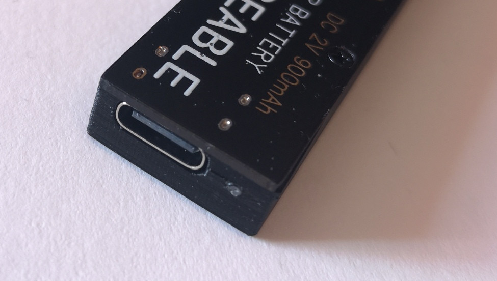
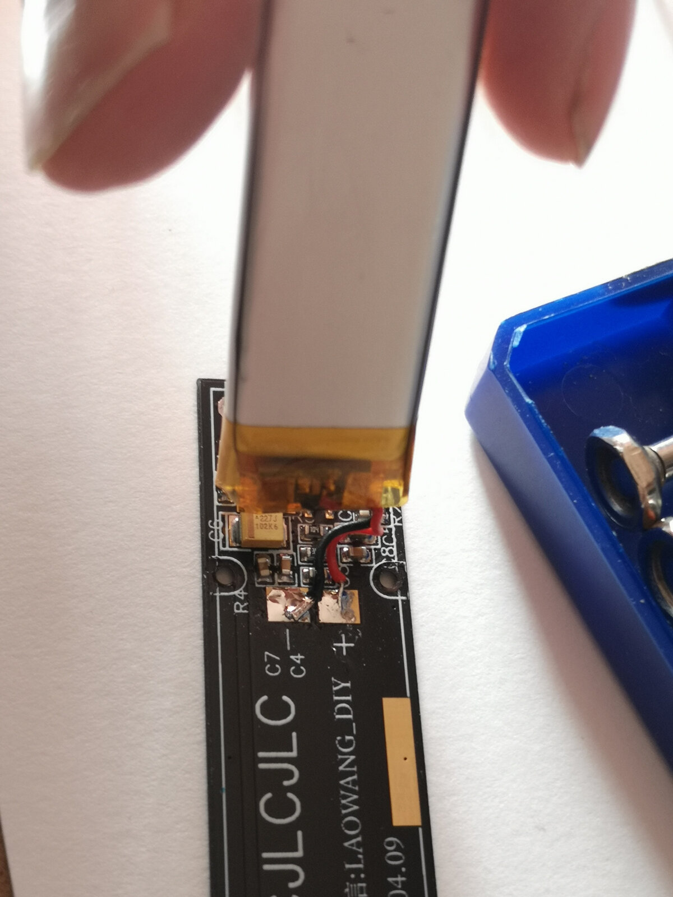

= Research
ifndef::flag-book[]
:toc: right
:toclevels: 5
:sectnums:
:sectnumlevels: 5
endif::[]
ifdef::flag-book[]
:imagesdir-save: {imagesdir}
:imagesdir: research
endif::[]

Before any CAD or schematic work started, this project collected evidence:
teardown photos of the original PB-3, teardown photos of a working
Aliexpress clone, a forum thread archive, and the datasheets for the
candidate ICs. Everything downstream — measurements, mechanical envelope,
component selection, circuit emulation — traces back to a file in this
directory.

== Primary Source

* link:Rechargeable battery replacement for AIWA PB-3 _ PB-4 _ Stereo2Go forums.html[Stereo2Go forum thread]
  (offline archive) — "Rechargeable battery replacement for AIWA PB-3 / PB-4"
  (Rossoe et al., 2023-2025). Original:
  https://stereo2go.com/forums/threads/rechargeable-battery-replacement-for-aiwa-pb-3-pb-4.9025/.
  Source for the clone teardown photos, the LAOWANG_DIY PCB reference, the
  100kΩ→120kΩ resistor mod for voltage selection, and community pricing/part
  numbers.

== Original PB-3 Pack

.PB-3 label: DC 2V, 900mAh, Li-Polymer, rechargeable, two-pin blade

.PB-3 case detail: USB-C port molded into a 3D-printed shell

The original pack's own label already reveals the mismatch this project
resolves: it is printed "2V 900mAh Li-Polymer" although the AIWA-branded
factory part is a 2V sealed lead-acid (SLA) cell. The label documents the
*replacement's* chemistry and rating, not the OEM part. Additional
angles and connector close-ups are archived as `PB-3b.jpg`–`PB-3e.jpg` and
`PB3-f.jpg`.

== PB-S5 Clone Board (LAOWANG_DIY)

.LAOWANG_DIY PCB with LiPo pouch cell attached, marked C7/C4 pads

The PB-S5 shares its PCB with the PB-3 clone. Teardown photos
(`PB-S5b.jpg`–`PB-S5k.jpg`) show the flat LiPo pouch bonded directly to the
board, the charger/protection/buck ICs in SOT-23-6 packages, and the
feedback resistor referenced in the forum thread's voltage-selection mod.
`upload_2023-10-1_13-9-23.jpeg` is an additional forum upload showing the
assembled clone pack next to a host deck.

== Component Datasheets

Three IC families recur across the clone teardowns and this project's own
design in `kicad/README.adoc`. Each datasheet is archived here so the
component choice can be checked against real electrical limits instead of
guesswork.

CN3058E — LiPo linear charger::
`1811141710_Consonance-Elec-CN3058E_C83278.pdf`. Single-cell Li-ion/LiPo
linear charge management IC, SOT-23-6. Takes 5V USB-C input, delivers
CC/CV charging to the cell, and is the kind of part visible on the clone
PCB feeding the pouch cell in `PB-S5a.jpg`. Selected for its small
footprint and simple external component count (a handful of passives),
matching the tight 68×17.8×8mm enclosure.

DW01x — battery protection IC::
`DW01x-DS-17_EN.pdf`. Pairs with a dual N-MOSFET (e.g. FS8205A) to form a
discrete battery management system: overvoltage, undervoltage, and
overcurrent/short-circuit cutoff on the cell tabs. Chosen over relying on
the charger IC alone, so the pack still fails safe if the charger or buck
stage misbehaves.

TPS61023 — DC-DC regulator::
`tps61023.pdf`. SOT-23-6 DC-DC IC used to regulate the raw ~3.7V cell rail
down to the 2.0–2.4V the deck expects, with the feedback resistor pair
setting the output voltage — a higher resistor lowers the output. The
forum thread's own swap goes 100kΩ (PB-S5 clone's 2.4V default) to 120kΩ
(2.1V); reaching this project's 2.0V target extrapolates to a resistor
above 120kΩ. Its behavioral model stands in for the buck stage in
`kicad/pb3-replacement.cir`, described in the circuit design and
emulation step.

== What This Enabled

* `measurements/README.adoc` — caliper measurements of the original pack
  and the clone's cavity, confirming the 68×17.8×8mm envelope.
* `pb3-notes.adoc` — the reverse-engineering notebook that turns the above
  into derived requirements (chemistry, capacity target, connector
  compatibility, fault protection).
* `kicad/README.adoc` — schematic component selection and circuit
  emulation built on the ICs identified here.

//END OF DOC
ifdef::flag-book[]
:imagesdir: {imagesdir-save}
endif::[]
