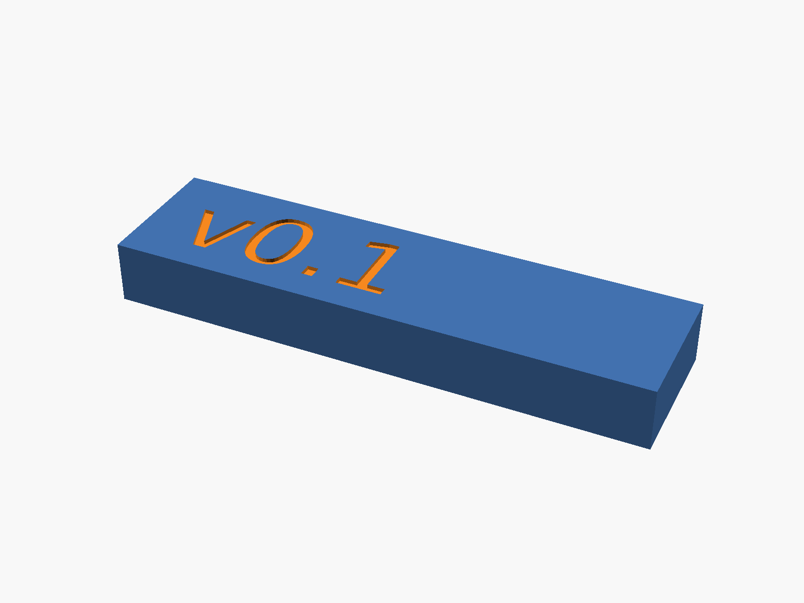

= Results & Compliance
ifndef::flag-book[]
:toc: right
:toclevels: 5
:sectnums:
:sectnumlevels: 5
endif::[]
ifdef::flag-book[]
:imagesdir-save: {imagesdir}
:imagesdir: results
endif::[]

This directory contains outputs generated by the containerized CAD and
simulation workflow. Do not edit these files by hand — they are evidence
that the design in `openscad/`, `kicad/`, and `images/` meets the two
targets set in the research and reverse-engineering steps: fitting the
original 68×17.8×8mm envelope, and delivering a safe, regulated 2.0V rail.

* `cad/` — OpenSCAD renders.
* `diagrams/` — PlantUML circuit and architecture diagrams.
* `kicad/` — KiCad board previews, schematic exports, and fabrication files.
* `circuit/` — ngspice logs and measurements.
* `docs/` — assembled HTML and PDF documentation (this book).

Rebuild everything with the `Build` GitHub Actions workflow, or run the
container commands in `.github/workflows/build.yml` locally.

== Physical Compliance

.`pb3-pack` fit-check render

`cad/pb3-pack.stl` is the printable gauge block for the 68×17.8×8mm
outline and 52×15×6mm cell cavity measured in `measurements/README.adoc`.
A print that fits the original PB-3 bay confirms the mechanical envelope
before any PCB is fabricated. `kicad/pb3-replacement-board.svg` and the
`kicad/fabrication/` gerbers/drill/position files are what a fabricator
needs to build the board that has to fit inside that same envelope.

== Electrical Compliance

`circuit/pb3-replacement.log` is the ngspice run of the circuit emulation
described in the "Circuit Design & Emulation" step. It should show
approximately 1.98V at the deck output, 198mA load current, and 3.7V at
the idealized cell — the pass condition for the regulated rail before
any bench measurement is taken.
`kicad/pb3-replacement-schematic.pdf` and `-schematic.svg` are the
schematic exports of the same design.

== Toolchain Proof

`kicad/batteryPack-schematic.pdf`, `batteryPack-pcb-top.svg`, and
`batteryPack-pcb-bottom.svg` are the outputs of the "KiCad Hello World"
toolchain check: the same KiCad → KiBot → CI pipeline used above, proven
on a known-good sample project first.

//END OF DOC
ifdef::flag-book[]
:imagesdir: {imagesdir-save}
endif::[]
